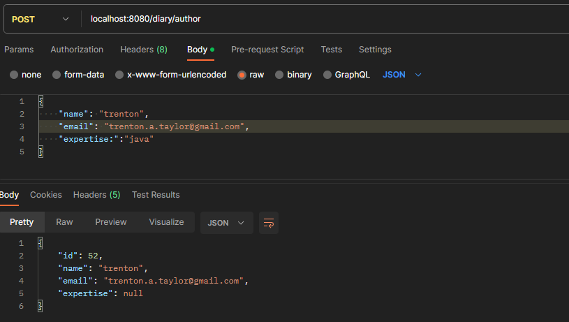
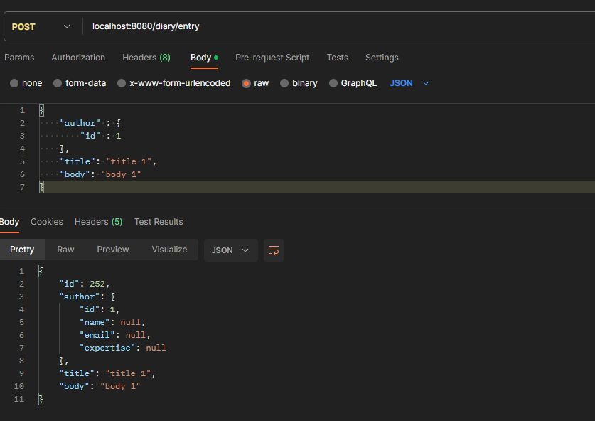

# Yeehaw! Welcome to the Ranch Hand Diary Application!

**This is a standalone Java/Spring Boot/Maven application that allows management of a set of posts, supposedly written by a ranch hand!**

Please create an application implementing a CRUD web service for `posts` using technology applicable to the position you are applying for.

- This application supports `CREATE`, `READ`, `UPDATE`, `DELETE` of a `diary entry` resource with validation.
- Support fetching multiple entries, a single entry, and filtering entries by author.
- Uses an in-memory database using H2 to manage data. (Hibernate switch also provided)
- Covers all the important behavior of the code with automated tests. Feel free to choose between integration tests and unit tests.

#### Additional topics

If you have extra time, we'd love to see what you create around any of the topics below:

- Utilize a database for persistent storage (Feel free to choose an engine of your choice)

When you are done, zip up the project and return it to your Big Nerd Ranch contact.

#### Sample Data

Below, you'll find some sample data to help structure your models and seed your database:

### Posts






```
[
  {
    "userId": 1,
    "id": 1,
    "title": "Node is awesome",
    "body": "Node.js is a JavaScript runtime built on Chrome's V8 JavaScript engine."
  },
  {
    "userId": 1,
    "id": 2,
    "title": "Spring Boot is cooler",
    "body": "Spring Boot makes it easy to create stand-alone, production-grade Spring based Applications that you can "just run"."
  },
  {
    "userId": 2,
    "id": 3,
    "title": "Go is faster",
    "body": "Go is an open source programming language that makes it easy to build simple, reliable, and efficient software."
  },
  {
    "userId": 3,
    "id": 4,
    "title": "'What about me?' -Rails",
    "body": "Ruby on Rails makes it much easier and more fun. It includes everything you need to build fantastic applications, and you can learn it with the support of our large, friendly community."
  },
  {
    "userId": 4,
    "id": 5,
    "title": ".NET has the gravy",
    "body": ".NET enables engineers to develop blazing fast web services with ease, utilizing tools developed by Microsoft!"
  }
  
]
```

### Users

```
[
  {
    "id": 1,
    "name": "Ryan Dahl",
    "email": "node4lyfe@example.com",
    "expertise": "Node"
  },
  {
    "id": 2,
    "name": "Rob Pike",
    "email": "gofarther@example.com",
    "expertise": "Go"
  },
  {
    "id": 3,
    "name": "DHH",
    "email": "magic@example.com",
    "expertise": "Rails"
  },
  {
    "id": 4,
    "name": "John Watkins",
    "email": "jwats@example.com",
    "expertise": ".NET"
  }
]
```